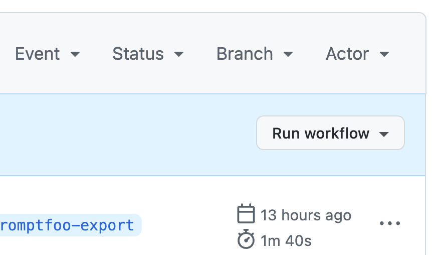
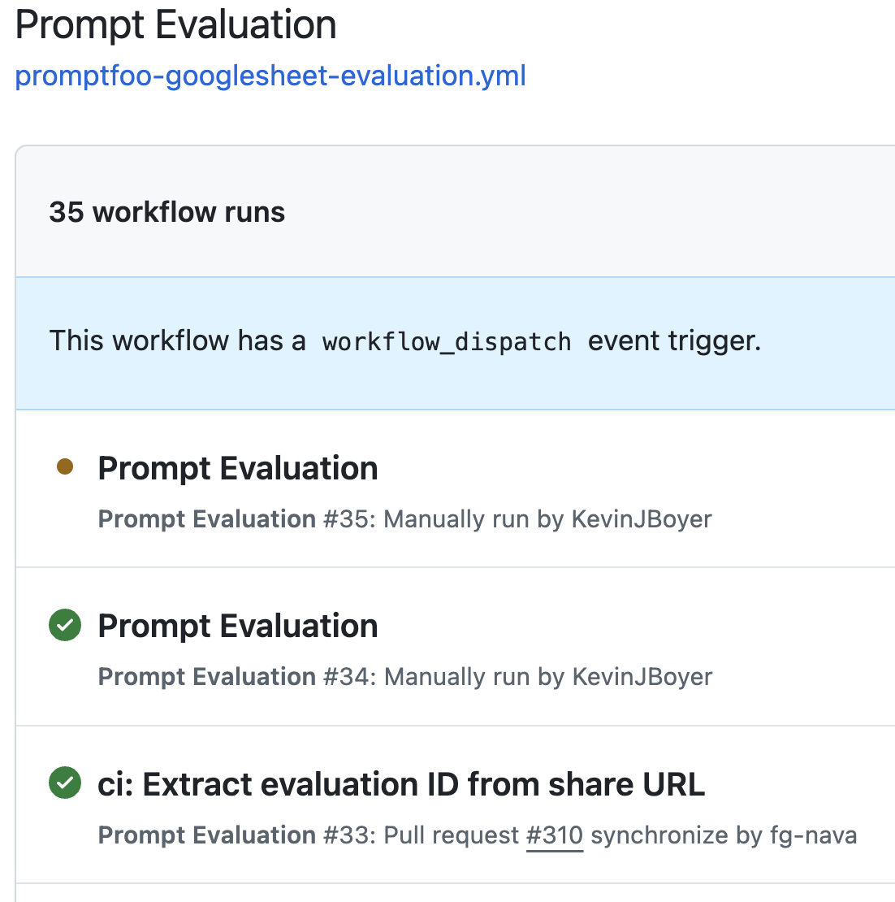

# Promptfoo evaluations

We use [Promptfoo](https://promptfoo.dev) to automatically evaluate the chatbot's performance on prepared test inputs. Nava team members can create Google Sheets and run the chatbot against them using GitHub actions.

## How to run evaluations against a Google Sheet

1. Create a new Google Sheet ([sheets.new](https://sheets.new)) 
2. Create three columns: `capability`, `question`, and `__expected1`.
  - `capability` should describe what you'd like to test, e.g., "It refuses to answer out of scope questions"
  - `question` is the input that will be sent to the chatbot, e.g., "How do I apply for PFML in Massachusetts?"
  - `__expected` is the assertion used to access the chatbot's output, e.g., `contains:Sorry, I can't answer that.`
See [this sheet for a minimal example](https://docs.google.com/spreadsheets/d/1xpOBO7FnRgmgILYwn0gj_LGqqdpi-E5cfQxdgscw21s/edit?gid=0#gid=0). There are many other types of assertions in addition to `contains:`: Promptfoo's documentation has a [list of assertion types](https://www.promptfoo.dev/docs/configuration/expected-outputs/#assertion-types). Its documentation also has [additional details about the promptfoo sheet format](https://www.promptfoo.dev/docs/configuration/parameters/#import-from-csv) if you're interested or need additional functionality.
3. Copy the URL of the Google Sheet you've created, e.g., `https://docs.google.com/spreadsheets/d/1xpOBO7FnRgmgILYwn0gj_LGqqdpi-E5cfQxdgscw21s/edit?gid=0#gid=0`
4. Go to the [Prompt Evaluation GitHub action](https://github.com/navapbc/labs-decision-support-tool/actions/workflows/promptfoo-googlesheet-evaluation.yml).
5. Click "Run workflow":

6. Paste in the Google Sheet URL into both the  `Google Sheet URL for test case inputs` and `Google Sheet URL for evaluation outputs` fields. Leave `Use workflow from` and `Chatbot API endpoint URL` set to their defaults. Additional detail about these is below in Advanced Usage.
7. Click `Run workflow`. The page will not refresh immediately. If you refresh, you should see your workflow in the list with a yellow icon indicating that it's running: 

8. After about three to five minutes, the workflow should finish running (the icon will change to a green checkmark.) The results of your evaluation will be in the Google Sheet.

## Advanced usage

### Run workflow from

You can change the `Run workflow from` dropdown to select a branch that GitHub will use for executing the action. If you are not an engineer, you should ignore this option and always leave it set to `main`.

### Chatbot API endpoint URL

By default, the version of the chatbot that is evaluated is our DEV instance. You can manually change this to, for example, evaluate a different version of the chatbot's prompt in a preview environment, e.g., `https://p-310-app-dev-652842717.us-east-1.elb.amazonaws.com/api/query`.