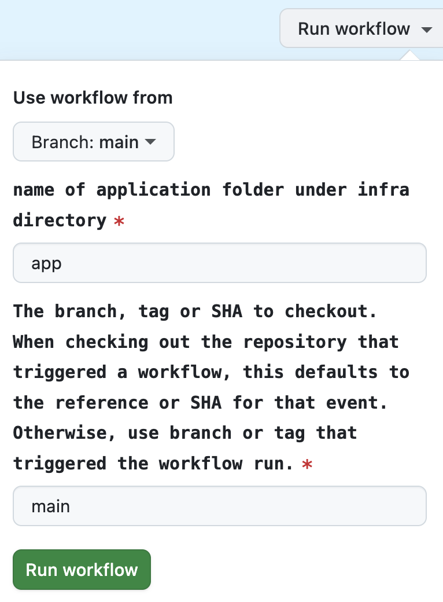

# Runbook cheat sheet

Welcome! This is a quick guide for:

 - standing up a new instance of the chatbot in an AWS environment,
 - ingesting and refreshing the data in the chatbot, and
 - deploying new versions of the chatbot.

## Standing up a new instance of the chatbot

These steps will walk you through create a new hosted instance of the chabot running in an environment named `dev`. You can follow them again but replacing `dev` with `prod`, etc., to create multiple hosted instances of the chatbot.

### Prerequisites

You'll need:

 - An AWS account
 - An OpenAI API key
 - Git, Terraform, and `tfenv` installed on your laptop

### Setting up the repository and code base

1. Clone the Nava PBC repository ([http://github.com/navapbc/labs-decision-support-tool](http://github.com/navapbc/labs-decision-support-tool)) into a new repo on GitHub.com
1. Update the values in `infra/project-config/main.tf`:
    1. Set `code_repository_url` to the URL of the new repository you created.
    1. Set `project_name` and `owner` to your preferred values.
1. Update the `domain_name` in `infra/app/app-config/dev.tf`

### Create the infrastructure

1. In the AWS console, create a new IAM user and add them to an IAM group with the `AdministratorAccess` policy
1. In the AWS console, navigate to the parameter store and create two new secrets, `/app-dev/OPENAI_API_KEY` and `/app-dev/LITERAL_API_KEY`. The secret type should be "secure string". Enter the API keys the chatbot will use for these two services as the values.
1. Navigate to the root of the repo in the terminal.
1. Authenticate in your local terminal:
    1. Run `aws configure --profile <name of IAM user>`, replacing `<name of IAM user>` with the username
    1. Set this profile as your default with `export AWS_PROFILE=<name of profile created in prior step>`,
    1. Verify that you are authenticated into the correct role with `aws sts get-caller-identity`
1. Set the Terraform version with `tfenv use 1.10.5`
1. Run `make infra-set-up-account ACCOUNT_NAME=<name of AWS account>`, replacing ACCOUNT_NAME with your preferred reference for the AWS account the infrastructure is being created in.
1. Run `make infra-configure-network NETWORK_NAME=dev`
1. Run `make infra-update-network NETWORK_NAME=dev`
1. Run `make infra-configure-app-build-repository APP_NAME=app`
1. Run `make infra-update-app-build-repository APP_NAME=app`
1. Run `make infra-configure-app-database APP_NAME=app ENVIRONMENT=dev`
1. Run `make infra-update-app-database APP_NAME=app ENVIRONMENT=dev`
1. Run `make infra-update-app-database-roles APP_NAME=app ENVIRONMENT=dev`
1. Run `make infra-configure-app-service APP_NAME=app ENVIRONMENT=dev`

### Deploy the application
1. Navigate to the GitHub Actions `Deploy App` workflow, at https://github.com/<YOUR_REPO_NAME>/actions/workflows/build-and-publish.yml
1. Click `Run workflow` and enter `app` as the name of the application folder and `main` as the branch to check out:

1. When the action finishes, click into the action summary and find the IMAGE_TAG in the logs (it will look like a long hexadecimal number, e.g., `8cc1bdf05e9786f515f102a8a4ed769b79d80484`)
1. From your terminal run `TF_CLI_ARGS_apply="-var=image_tag=<IMAGE_TAG>" make infra-update-app-service APP_NAME=app ENVIRONMENT=dev`, replacing `<IMAGE_TAG>` with the hex identifier from the prior step
1. Commit all of the changes and new files created from these steps and push them to the `main` branch of the repository. This will trigger an automatic deploy.

If you didn't configure a domain name, you can find an autogenerated URL: from the GitHub `Deploy App` action, find the `service_endpoint` in the logs, which will look something like e.g., `http://app-dev-550258846.us-east-1.elb.amazonaws.com`. 

## Ingesting and refreshing data in the chatbot

1. Navigate to the `/app` directory within the repo in your local terminal
1. Set `CONTENT_HUB_SPACE_ID` both in `.env` and in your local environment, with `export CONTENT_HUB_SPACE_ID="space_id_here" && export CONTENT_HUB_ACCESS_TOKEN="access_token_here"`
1. Run the refresh ingestion script: `./refresh-ingestion.sh all`.
1. The refresh ingestion script will create two files, `refresh-dev-*.sh` and `refresh-prod-*.sh`, where `*` reflects the timestamp that ingestion was run. Running these scripts (e.g., `./refresh-dev-*.sh`) will push the data to the corresponding AWS environment.

## Deploying new versions of the chatbot

By default, commits to `main` automatically trigger a deployment to the `dev` environment. If you also have a production environment available, you can manually trigger deploys to it using the `Deploy App` workflow at https://github.com/<YOUR_REPO_NAME>/actions/workflows/cd-app.yml:

1. Click the `Run workflow` button
1. Ignore the `Use workflow from` dropdown
1. Select the environment you want to deploy to under `Environment to deploy to`
1. Select the code you'd like to deploy under `Tag or branch or SHA to deploy` (usually `main`)
1. Click `Run workflow`